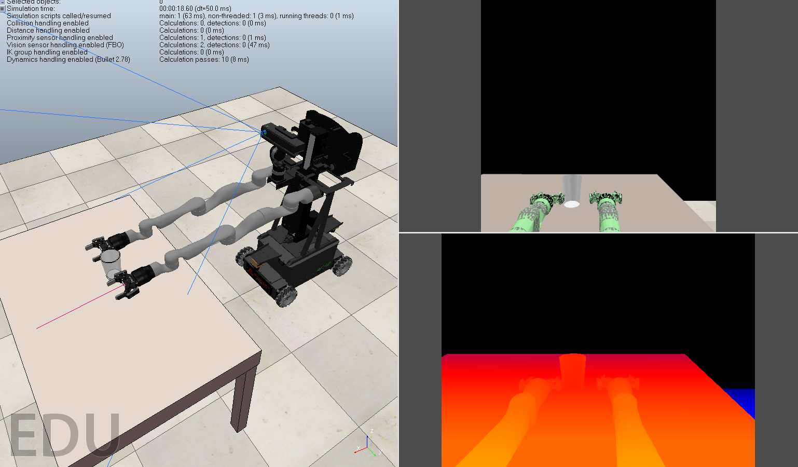
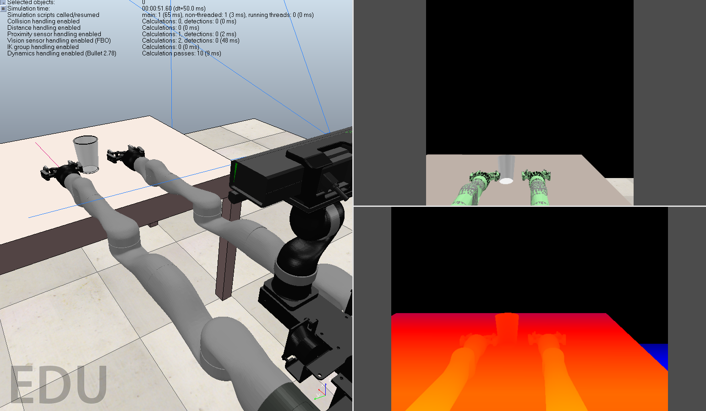

# CS699 Report

Final report for CS699 Directed Study under Prof. Michael Gleicher.
Worked on various robotics projects including robot mimicry control
and simulations using ROS, CoppeliaSim and Unity.

## 1. Files
1. [Movo control ROS package](https://github.com/joshuawisc/movo-control-2)
2. [Movo simulation scene](https://github.com/joshuawisc/movo-sim-scene)
3. [Unity robot models](https://github.com/joshuawisc/UnityRobotModels)

## 2. [Report](Report.md)

## 3. Results

